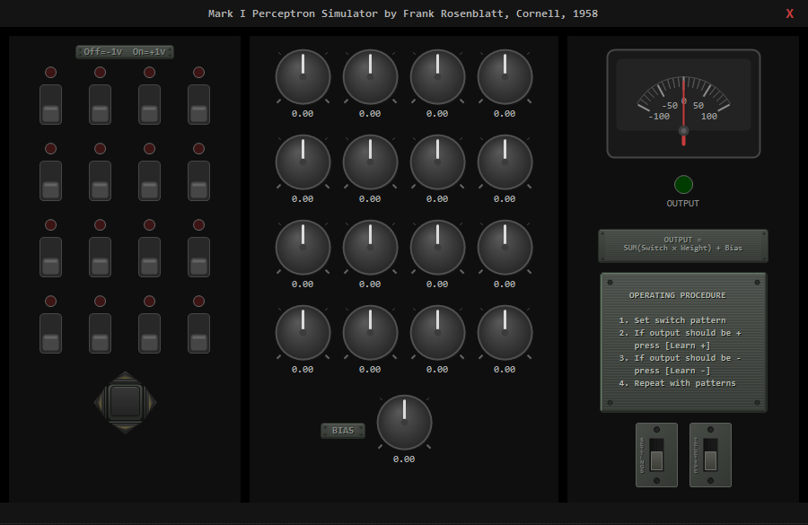
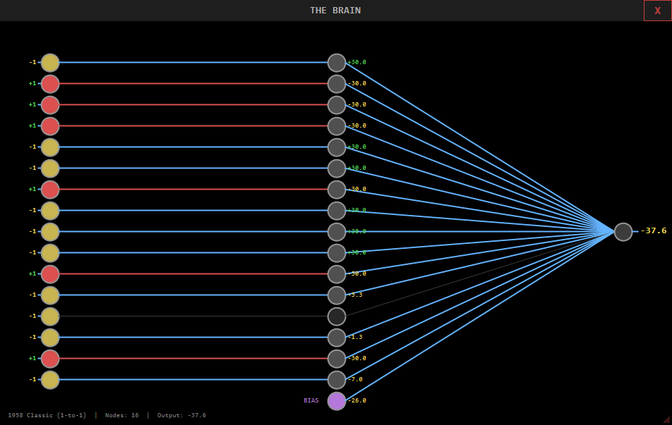
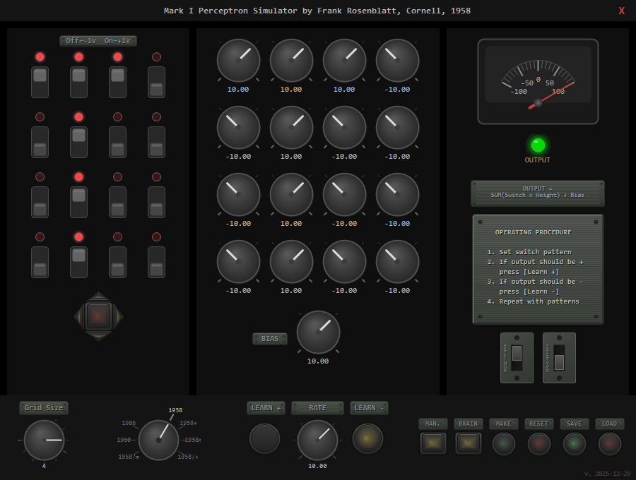
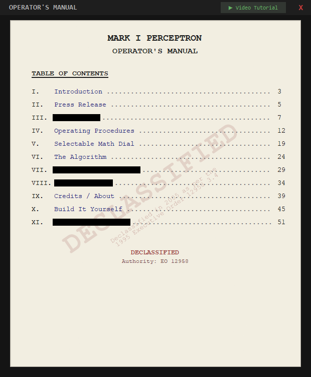
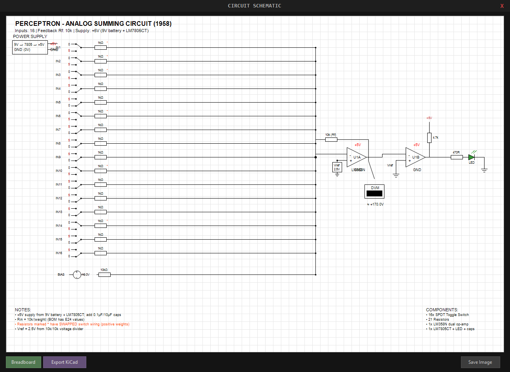
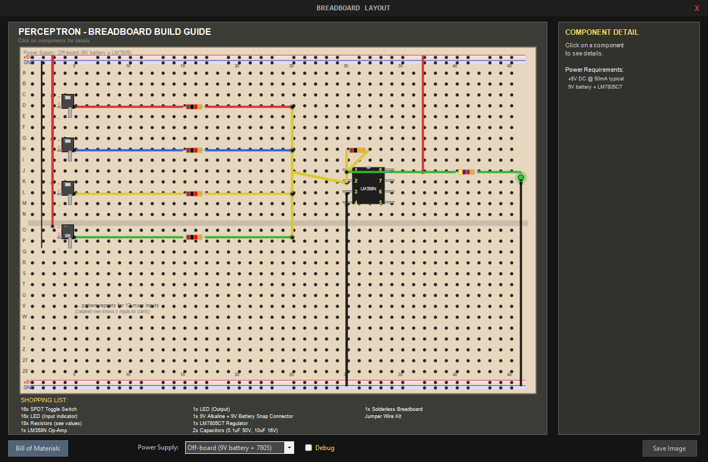

# Mark I Perceptron Simulator

[**▶ Video Tutorial**](https://www.youtube.com/watch?v=l-9ALe3U-Fg)

### *The Machine That Started It All — Recreated in Code*

<p align="center">
  
  
  
  
</p>

---

**Do you want to understand AI at its most fundamental level?**

This program takes you back to the 1950s, where artificial intelligence was born — not inside a computer, but in analog hardware. The Mark I Perceptron was a physical machine made of wires, switches, and resistors that could *learn*. AI didn't start as software. It started as a circuit.

This simulator lets you operate that machine. Flip toggle switches, turn weight dials, and watch a neural network learn in real time. But it goes further than simulation: it gives you everything you need to **build the real thing**. Train any network, and the program generates a complete circuit schematic, an interactive breadboard layout, and a bill of materials with real part numbers you can order today. You can solder together a working perceptron on your desk.

The included Operator's Manual is styled as a declassified 1950s government document and covers the real history, the math, and step-by-step build instructions. Video tutorials walk you through it all.

Every line of this program was written by AI. And embedded inside it — in the Operator's Manual — is a complete copy of itself, written in plain English: the prompt that was used to generate the entire codebase. Feed that prompt back into an AI, and it rebuilds the program from scratch. This application carries an embryonic copy of itself within itself.

**An AI program about AI, written by AI, that contains the instructions to recreate itself.**

---

<p align="center">
  
</p>

**Keyboard Shortcuts:** When you click on a knob, use the up-down, left-right arrows.

> *"The Navy revealed the embryo of an electronic computer today that it expects will be able to walk, talk, see, write, reproduce itself, and be conscious of its existence."*
> — **New York Times, July 1958**

A topological look at the hardware configuration.

<p align="center">
  
</p>

---

## What Is This?

In **1958**, psychologist **Frank Rosenblatt** at Cornell built the **Mark I Perceptron** — a room-sized machine that could *learn to recognize patterns without being explicitly programmed*. It was the first artificial neural network, and it terrified and amazed the world in equal measure.

**This simulator recreates that historic machine** with a faithful vintage industrial aesthetic: toggle switches that click, rotary dials that turn, analog meters that swing, and backlit buttons that glow. It's not just a simulation — it's a *time machine*.

<p align="center">
  <b>🎛️ Flip switches. Turn dials. Watch a machine learn. 🎛️</b>
</p>

---

## Why Should You Care?

| If you're interested in... | This project offers... |
|---------------------------|------------------------|
| **AI/ML fundamentals** | Hands-on understanding of how neural networks *actually* learn — no black boxes |
| **History of computing** | A window into the 1958 breakthrough that started the AI revolution |
| **Beautiful UI design** | 15 custom-drawn controls with metallic textures, glow effects, and vintage aesthetics |
| **AI-assisted development** | A case study in building complex apps through natural language prompts |

---

## Features

### 🔘 Authentic Vintage Controls
Every control is custom-rendered with GDI+ graphics:
- **Toggle switches** with LED indicators
- **Rotary knobs** with precise dial control (-30 to +30)
- **Analog meter** showing real-time output
- **Mechanical push buttons** with backlit glow effects
- **Brushed metal plates** with engraved text and corner screws

### 🧠 Real Perceptron Learning
This isn't a toy — it implements Rosenblatt's actual learning algorithm:
```
OUTPUT = Σ(Switch × Weight) + Bias
```
Train it to recognize "T" shapes vs "J" shapes. Watch the weights converge. *Feel* the math working.

### 🔀 Seven Selectable Math Rules (1958-1986)
Turn the **Math Dial** to switch between seven different learning algorithms:
- **1958** (1 o'clock): Original Rosenblatt perceptron (1-to-1 connectivity)
- **1958+** (2 o'clock): Fully connected, sum rule
- **1958m** (3 o'clock): Fully connected, average rule
- **1958/+** (4 o'clock): Input-normalized, sum rule
- **1958/m** (5 o'clock): Input-normalized, average rule
- **1960** (9 o'clock): Widrow-Hoff / LMS / Delta rule
- **1986** (10 o'clock): Multi-layer perceptron with ReLU + backpropagation
- Experience the evolution of neural network math from Rosenblatt to Rumelhart!

### 📖 Built-In Historical Manual
A complete operator's manual styled like a declassified 1950s government document:
- Original 1958 New York Times press release
- Step-by-step operating procedures
- The algorithm explained
- "DECLASSIFIED" watermark for authenticity
- **Chapter X: Build It Yourself** — Complete hardware build guide with:
  - Professional circuit schematic with op-amp symbols
  - Interactive breadboard layout with hover tooltips
  - Bill of Materials with real part numbers and prices
  - Export BOM to CSV for ordering

### 🔬 Interactive Neural Network Visualizer
Click **BRAIN** to see "THE BRAIN" — an interactive network topology view:
- Input nodes light up based on switch states — **click them to toggle switches!**
- Connection weights shown on each line (red for active +1 inputs)
- **Click hidden nodes** then use arrow keys to adjust weights directly
- Watch signals flow through the network as you adjust dials

### 🖨️ Vintage Teletype Debug Output
Toggle the **TELETYPE** switch to open a 1950s-style teletype printer window:
- Striped dot-matrix printer paper with alternating cream/blue bars
- Perforated tractor-feed holes along both edges
- Embedded Special Elite typewriter font for authentic output
- Real-time debug logging to `%AppData%\Mark1\Log.txt`
- Adjustable font size with +/- buttons

### 📐 Scalable Grid
Adjust the grid from 1×1 to 10×10 — the entire UI dynamically scales. At 10×10, you have **100 switches and 100 dials** working in concert.

### 🥚 Easter Egg: Linear Mode
At grid size 1, keep turning the knob down to enter **linear mode**:
- Add nodes one at a time (2, 3, 4... up to 25)
- Nodes wrap at 5 per row — create any configuration you want
- Perfect for experimenting without the constraints of square grids

### ✅ Circuit Electrically Validated
**The circuit has been professionally audited and verified:**
- ✅ Schematic validated against electronics principles
- ✅ Breadboard verified to match schematic exactly
- ✅ KiCad export tested with complete netlist
- ✅ Buildable and will function correctly when built
- See **CIRCUIT_AUDIT.md** for full validation report

### ⚡ Build Your Own Physical Perceptron
The app includes complete hardware build documentation with PROFESSIONAL-GRADE tools:
- **Circuit Schematic**: Professional schematic with gap-free connections, calculated resistor values
  - **KiCad Export**: Export to .kicad_sch format for professional EDA editing
  - **SPICE Simulation**: Verify circuit operation in KiCad/ngspice
- **Interactive Breadboard**: Electrically-accurate breadboard layout with:
  - **Hole-based placement**: Components at specific (row, column) coordinates
  - **Electrical connectivity modeling**: Holes represent actual breadboard connections
  - Power rails in dense clusters (groups of 5 with 1-space gaps)
  - Scalable view: Shows 4 inputs in detail, notes pattern for additional inputs
  - Row/column numbering (A-Z, 5/10/15...) for precise placement
  - Thick, visible wiring (4-5px) with color-coding
  - **Power supply selector**: Choose off-board, on-board battery, USB 5V, or bench supply
  - Hover tooltips showing component specs and exact hole positions
- **Bill of Materials**: Complete BOM with real manufacturer part numbers, prices, and suppliers
- **Export to CSV**: One-click export for ordering from DigiKey/Mouser
- Total kit cost: ~$15-25 for basic 4-input perceptron

---

## The Secret Inside

**This program contains its own DNA.**

Embedded in the application is `prompt.txt` — the complete English-language instructions used to generate this entire codebase. Feed it into Claude Code, and you can *recreate the application from scratch*.

```
I predict, one day, we won't share code — we will share prompts.
And so I am starting the trend today.
```

This is **executable English**: software that reproduces itself through natural language.

---

## Quick Start

### Option 1: Download and Run
Download the latest release from the [Releases](../../releases) page and run `PerceptronSimulator.exe`.

### Option 2: Build from Source
```bash
git clone https://github.com/srives/Perceptron.git
cd Perceptron
dotnet build
dotnet run
```

### Option 3: Recreate It Yourself
1. Install [Claude Code](https://claude.ai/claude-code)
2. Copy `resources/perceptrons.png` to `c:\temp\`
3. Feed `resources/complete_prompt.txt` into Claude Code
4. Watch it build the entire application from English

---

## How to Use

1. **Create a pattern** — Click switches to form a shape (try a "T")
2. **Press Learn+** — Tell the machine this pattern should output POSITIVE
3. **Create another pattern** — Clear and make a "J" shape
4. **Press Learn-** — Tell the machine this pattern should output NEGATIVE
5. **Test it** — The meter and LED now correctly classify your patterns!

The machine learns by adjusting dial weights. After a few examples, it generalizes to patterns it's never seen.

---

## The Story Behind This

This project was built **entirely through conversation with Claude Code AI** as an homage to the pioneers of neural networks. No code was written by hand — every line emerged from natural language prompts.

What took Frank Rosenblatt years of research and a room full of hardware, I recreated in a weekend through conversation with an AI. The irony isn't lost on me: **using a descendant of the perceptron to rebuild its ancestor.**

---

## Technical Details

This program was written using Claude Code. 
It is an AI program that teaches the foundations of AI, written with AI, for AI and the ability to remake itself with built-in AI prompts.
| Efficiency Multiplier | **8-12×** |

---

## Screenshots

### Main Interface
The full simulator with toggle switches, rotary weight knobs, analog meter, and vintage control panel.


### Training in Action
After training, the perceptron has learned weights and the output LED lights up for recognized patterns.



### Operator's Manual
A declassified 1950s-style manual with redacted chapters, operating procedures, and build instructions.



### Circuit Schematic
Professional schematic of the analog summing circuit with LM358 op-amp, SPDT switches, and calculated resistor values. Exportable to KiCad.



### Breadboard Layout
Interactive, electrically-accurate breadboard view with hole-based component placement, color-coded wiring, and hover tooltips.



---

## Credits

- **Frank Rosenblatt** (1928-1971) — For inventing the perceptron and starting the AI revolution
- **Welch Labs** — For the [excellent educational video](https://www.youtube.com/watch?v=l-9ALe3U-Fg) that inspired this project
- **Anthropic's Claude** — For being an exceptional coding partner
- Steve Rives, AI Engineer

---

## License

MIT License — Use it, learn from it, share it.

---

<p align="center">
  <i>"The perceptron is the embryo of an electronic computer that will be able to walk, talk, see, write, reproduce itself, and be conscious of its existence."</i><br/>
  <b>— Dr. Frank Rosenblatt, 1958</b>
</p>

<p align="center">
  <i>He wasn't entirely wrong. It just took 67 years.</i>
</p>

---

<p align="center">
  <b>⭐ Star this repo if you believe the future of software is natural language ⭐</b>
</p>
